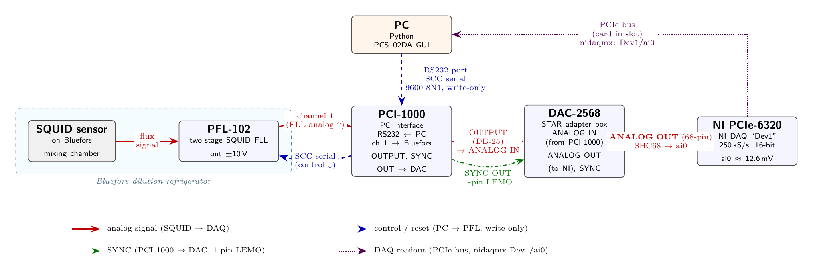

# `AutoSQUID` — SQUID measurement-cycle + auto-S-tune

This package is developed specifically for performing/automating superconductor quantum interference device (SQUID) measurements. It's developed using Star Cryoelectronics PFL-102, PCI-1000, and DAC-2568 and a national instrument (NI) data acuisition (DAQ) card PCIe-6320. **All settings live in the notebook** as one `Config` object; all logic lives in the modules here. The package imports `nidaqmx` + `pyserial` (it assumes a STAR Cryo + NI rig); the MXC thermometer is **not** imported — you plug your lab's reader into `cfg.temp_reader` in the notebook.

> **Full reference:** `AutoSQUID_protocol.pdf` (this folder) — the configuration table, the PCIe-6320 DAQ and PFL-102/SCC details, the reset protocol, the run loop, the operating procedure, and the auto-S-tune procedure. This README is the orientation + quick-start; the protocol is the bench reference.

## What it does

For one fixed temperature, and for each scan interval, collect a target number of clean, gap-free time-series runs at the chosen sample rate. It watches for a flux-lock jump while acquiring, resets the feedback locked loop (FLL) and re-acquires on a failure, logs the MXC temperature throughout, and saves each trace in the standard `PCS102` text format with an append-only run ledger. A companion notebook centers the locked output near 0 mV before the run (auto-S-tune).

## Wiring



Analog: SQUID/PFL-102 (Bluefors) → PCI-1000 ch.1 → PCI-1000 OUTPUT → DAC-2568 ANALOG IN → ANALOG OUT (68-pin)
→ PCIe-6320 `ai0` (read over the PCIe bus via `nidaqmx`). Control: PC → PCI-1000 RS232 → PFL (SCC serial,
write-only). Sync: PCI-1000 SYNC OUT → DAC-2568 (1-pin LEMO).

## Layout

| module             | role                                                                                                                              | deps               |
| ------------------ | --------------------------------------------------------------------------------------------------------------------------------- | ------------------ |
| `util.py`        | generic helpers (`clamp`)                                                                                                       | —                 |
| `config.py`      | `Config` dataclass — every knob + derived paths / filename stem / PFL register                                                 | —                 |
| `scc.py`         | SCC framing:`assemble_command`, `pfl_register`, `dac_data` (OpenSQUID-derived)                                              | —                 |
| `analysis.py`    | detection + I/O:`is_surge_spec`, `chunk_jump`, `format_temp_label`, PCS102 read/write, ledger, `scan_indices`             | numpy, pandas      |
| `serial_io.py`   | SCC writes:`reset`, `fire_reset`, `s_lock`/`s_tune`, `set_squid_flux`/`_bias`, `set_array_bias`                     | pyserial           |
| `daq.py`         | NI reads:`daq_read`, `daq_mean`, `live_mean`, `classify`, `detect_ai_channel`, `acquire_finite_chunked`               | nidaqmx            |
| `temperature.py` | MXC `read_temp` (via injected `cfg.temp_reader`) + background `TempLogger`                                                  | — (injected)      |
| `measurement.py` | state machine:`run_cycle` (one interval), `reset_and_verify`, `resolve_temp_label`; the interval loop lives in the notebook | —                 |
| `tuning.py`      | `auto_s_tune` — live-center the locked output near 0 by stepping S-flux (secant search)                                        | —                 |
| `plotting.py`    | `plot_run` — raw trace + temperature, read back from disk                                                                      | matplotlib, pandas |

`util`/`config`/`scc` use only stdlib; `analysis`/`plotting` add `numpy`/`pandas`/`matplotlib`; `serial_io`/`daq`
import their instrument backends (`pyserial`/`nidaqmx`) at module top — the package assumes the STAR Cryo + NI
rig — while `temperature` imports no thermometer backend and reads through the injected `cfg.temp_reader`. So
`import AutoSQUID` needs `nidaqmx`, `pyserial`, `numpy`, `pandas`, and `matplotlib` (but no lab thermometer
library). Dependency order: `util` → `scc`/`config` → `analysis` → `serial_io`/`daq`/`temperature` →
`measurement`/`tuning`/`plotting`.

## Notebooks (in this folder)

- **`example_measurement_cycle.ipynb`** — the minimal showcase: build `Config` (set `data_root`/`user`/`date`
  and your `cfg.temp_reader`) → `detect_ai_channel` → `resolve_temp_label` → the interval loop
  (`sq.run_cycle(cfg, tau)`). Copy it and fill in your lab's values.
- **`auto_s_tune.ipynb`** — build `Config` → `sq.s_lock(cfg)` then `sq.auto_s_tune(cfg)`.

Each prepends `..` to `sys.path` so `import AutoSQUID` resolves from inside the folder; the §0 cell imports
your lab's thermometer reader and assigns it to `cfg.temp_reader`.

## Quick start (bench PC)

```python
import AutoSQUID as sq
cfg = sq.Config(scan_interval_s=[100e-6], n_trials=2, port="COM3",
                data_root=r"", user="", date="")     # set your data_root / user / date
# plug in your lab's thermometer reader: fn(channel) -> T in K
cfg.temp_reader = lambda ch: ...                     # define for your thermometer (returns T in K)
dev, cfg.daq_ai = sq.detect_ai_channel(cfg)          # §1 pick the live ai0
print(sq.read_temp(cfg))                             # confirm the MXC backend
for tau in cfg.scan_intervals:                       # §2 acquire (lock the FLL first!)
    if sq.run_cycle(cfg, tau) == "reset_fail":
        break
sq.plot_run(cfg)                                     # §3 plot from disk
```

First run on the hardware: do the one-time bring-up in the protocol (§ Operating procedure) as a supervised
dry run — do not "Run All" blind.

## Required fields (validated at the use site)

`run_cycle()` raises **before any reset or write** unless `data_root`, `user`, and `daq_ai` are set; with
`temp_label="auto"` it also requires `temp_reader`. `auto_s_tune()` requires only `daq_ai` and `port`.
`Config()` itself is passive — it doesn't validate.

Set `cfg.temp_reader` for **any** acquisition run: `run_cycle()` starts a background `TempLogger` that reads
through it every `temp_every_s`, so without it the per-trace `_temp.csv` is all `nan`. A literal `temp_label`
(e.g. `"14mK"`) only sets the filename label — it does not disable temperature logging.

## Behavior (per scan interval)

Collect `n_trials` CLEAN traces within `max_attempts` real acquisitions. Each acquisition is order-indexed
`i`: clean → `DAQ_{MonDD}_{tau}us_{label}_{npts}_{i}.txt` (+ `_{i}_temp.csv`), failed →
`…_{i}_{JUMP|SURGE|RAIL|BADBASE}.txt`. `i` continues past existing files, so re-running **resumes / tops up
and never overwrites**. A reset fires only after a failed acquisition, never between clean traces; a
non-clearing reset — or a bad baseline at the start (the reset didn't hold) — is systemic and **stops the
whole sweep**. Every acquisition + reset is appended to `experiment_log.txt`.

A trace is labeled **CLEAN only after a post-hoc `is_surge_spec` check passes**: no rail, no >6σ baseline
jump, and no frozen/stuck flat segment (flagged when a chunk's std collapses below the live noise level).
Anything failing is saved with a `_JUMP`/`_SURGE`/`_RAIL`/`_BADBASE` suffix. (Still re-run the standalone
integrity gate before downstream analysis.)

`vrange = ±1 V` (matches previous measurements): finer ADC resolution, but the ADC clips ~1 V, so `jump_v`
(default 0.5 V) catches an in-range slip and `rail_v` (9.5 V) is dormant until the card returns to ±10 V.

## Data layout

Everything is written under `cfg.outdir = data_root / user / date`:

```
<data_root>/                                       # cfg.data_root  (set per install)
└─ <user>/                                         # cfg.user
   └─ <date>/                                      # cfg.date   ("" → the bare <user>/ folder)
      ├─ DAQ_{MonDD}_{tau}us_{label}_{npts}_{i}.txt        # clean trace, e.g. DAQ_Jun01_100us_14mK_10Mpts_1.txt
      ├─ DAQ_{MonDD}_{tau}us_{label}_{npts}_{i}_temp.csv   # that trace's MXC log (columns: time_s, T_K)
      ├─ DAQ_..._{i}_{JUMP|SURGE|RAIL|BADBASE}.txt         # failed trace (+ its _temp.csv)
      ├─ experiment_log.txt                                # per-acquisition numeric ledger
      └─ action_log.txt                                    # results-free event log (resets, temp, attempts)
```

`{i}` is the order index and continues across days; matching ignores the `{MonDD}` date, so traces from any day in `<date>/` count toward the same `{tau}us_{label}_{npts}` core.

## Analysis (PSD)

`data_analysis.ipynb` reads traces back from disk and plots PSDs with
`plot_psd(path, filename, conversion, P=…, clean_only=True)`. Traces are stored in **raw volts** with no
calibration baked in; `plot_psd` multiplies by the per-cooldown `conversion` factor (f₀/V) to give a flux PSD
(f₀²/Hz), so you must pass the **correct cooldown calibration yourself** — it isn't recorded with the trace.
`clean_only=True` runs the `is_surge_spec` integrity gate on each trace and skips any that fail.

## Auto-S-tune

`auto_s_tune` automates the manual "nudge S-flux until the trace is centered at 0 mV": with the SQUID
**locked**, it steps the SQUID-flux DAC and reads a short finite live-mean each step, using a secant update
(`dx = (target − mean)/slope`) so the sign and gain are measured, not assumed — no reset between steps.
Stops when the live mean is within `tol_V` (default 3 mV) of target, or at one DAC LSB. Returns
`dict(status ∈ {converged, dac_limited, no_response, max_iter}, flux_sflux, mean_V, std_V, n_iter)` (`dac_limited` = as centered as one DAC LSB allows, still outside `tol_V`). `no_response` means the
live mean doesn't move with the S-flux steps — typically not locked, wrong `daq_ai`, or S-flux not reaching the SQUID.
See the protocol's auto-S-tune section for the full procedure.

## Contact

For questions, bug reports, or setup issues, please feel free to contact:

- Zhengyue Chen — czhengyue@wustl.edu
- Sheng Ran — rans@wustl.edu
